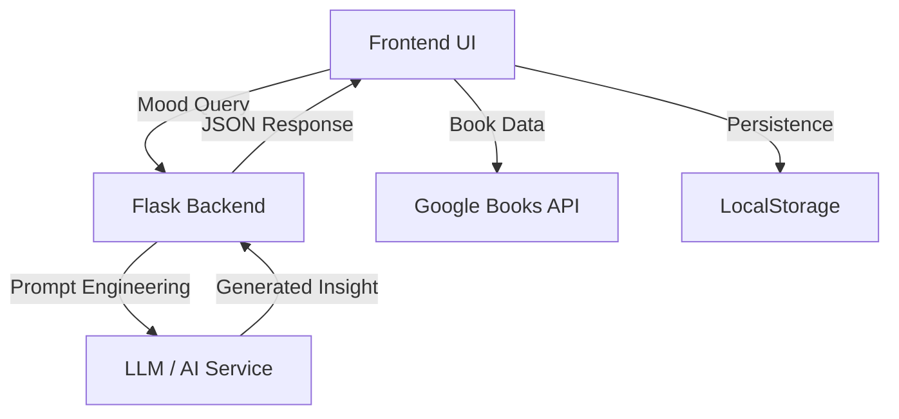

# 🌌 BiblioDrift — Drift Through Stories, Not Screens

### 🌙 *A calm, immersive, AI-powered book discovery experience*

> **"Find yourself in the pages."**

BiblioDrift transforms book discovery into an emotional journey —  
where stories are explored through <b>mood, atmosphere, and feeling</b> instead of endless scrolling.

🌧️ Mood-first discovery • 📚 Immersive reading • 🤖 AI-powered storytelling

---

## 🌌 Table of Contents

| 📚 Section | 🔗 Description |
|---|---|
| 💭 **[The Idea](#-the-idea)** | Vision and inspiration behind BiblioDrift |
| 🧘 **[Core Philosophy](#-core-philosophy)** | Principles that shape the experience |
| ✨ **[Experience Highlights](#-experience-highlights)** | Main features and immersive interactions |
| 🛠️ **[Tech Stack](#-tech-stack)** | Technologies powering the platform |
| 🧠 **[System Architecture](#-system-architecture)** | Flow between frontend, backend, and AI |
| 📸 **[Screenshots](#-screenshots)** | Visual preview of the application |
| 📄 **[License](#-license)** | Project licensing information |

## 🌿 The Idea

Most platforms make reading feel like:
- ❌ Endless scrolling  
- ❌ Algorithm overload  
- ❌ No emotional connection  

**BiblioDrift is different.**

It feels like:
> 📚 Walking into a quiet bookstore  
> ☕ Picking a book based on mood  
> 🌧️ Letting the atmosphere guide you  

---

## 🌟 Core Philosophy

- 🧘 **Zero UI Noise** → No clutter, no distractions  
- 🎭 **Vibe-First Discovery** → Search by *feeling*, not metadata  
- 📖 **Tactile Interaction** → Books behave like real objects  
- 🤖 **AI as a Bookseller** → Not recommendations, but *conversations*  

---

## ✨ Experience Highlights

### 📚 Interactive Library
- 3D books you can **pull, flip, and explore**
- Shelf-based organization (Want / Reading / Favorites)

### 🧠 AI-Powered Discovery
- Mood-based recommendations (e.g., *“rainy mystery”*)
- Dynamic AI-generated blurbs
- Conversational assistant → **Elara, the Bookseller**

### 🌌 Immersive UX
- Glassmorphism interface
- Ambient sounds (rain, fireplace,Calm Ocean Waves,Stormy Rain)
- Emotion-based tagging system

### ⚡ Performance & UX
- Skeleton loaders (smooth loading)
- LocalStorage persistence
- Seamless interactions

---

## 🛠️ Tech Stack

| Layer | Technology |
|------|-----------|
| Frontend | HTML5, CSS3 (3D), Vanilla JS |
| API | Google Books API |
| Backend | Flask, SQLAlchemy, JWT cookies |
| AI | LLM-powered notes, chat, and mood analysis |
| Storage | LocalStorage |

---
## 🚀 Backend Deployment & BACKEND_URL Setup

> ⚠️ The frontend is deployed on Netlify, but the Flask backend is **not yet deployed**.
> Google Sign-In and all AI features require the backend to be running.

### Why is this needed?
When a user clicks "Sign in with Google", the browser sends a request to `/api/v1/auth/google`.
Netlify needs to know where to forward that request, that's what `BACKEND_URL` is for.
Without it, Netlify has no rule for `/api/v1/*` and shows a 404 error.

### Step 1 — Deploy the Flask backend

You can deploy the backend (located in the `/backend` folder) to either:

| Platform | Free Tier | Docs |
|---|---|---|
| [Render](https://render.com) | ✅ Yes | [Render Python Docs](https://render.com/docs/deploy-flask) |
| [Railway](https://railway.app) | ✅ Yes | [Railway Docs](https://docs.railway.app) |

After deploying, you'll get a public URL like:
https://your-app.onrender.com

### Step 2 — Set BACKEND_URL in Netlify

1. Go to [Netlify Dashboard](https://app.netlify.com)
2. Open your site → **Site Configuration → Environment Variables**
3. Click **Add a variable**
4. Set:
   - **Key:** `BACKEND_URL`
   - **Value:** `https://your-app.onrender.com` *(no trailing slash)*
5. Click **Save**

### Step 3 — Redeploy the Netlify site

After setting the variable:
1. Go to **Deploys** tab in your Netlify dashboard
2. Click **Trigger deploy → Deploy site**
3. This reruns `build_netlify.py`, which picks up `BACKEND_URL` and adds the proxy rule to `_redirects`

After this, "Sign in with Google" will correctly reach the Flask backend. ✅

---
## 🧠 System Architecture

## 📸 Screenshots

	<h3>Discovery & Virtual Library</h3>
	
	  
	
	
	
<i>Capturing the tactile, vibe-first essence of BiblioDrift.</i>

---

## 📚 Documentation Hub

| 📄 Document | ✨ Description |
|---|---|
| 🧠 **[Architecture Guide](docs/architecture.md)** | Detailed system design, data flow, and backend structure |
| 📡 **[API Documentation](docs/api.md)** | API endpoints, request/response examples, and integration flow |
| 🚀 **[Roadmap](docs/roadmap.md)** | Upcoming features and future development plans |
| 🗂️ **[Project Structure](docs/project-structure.md)** | Complete folder hierarchy and project organization |
| 📖 **[Tutorial Guide](docs/TUTORIAL.md)** | Step-by-step setup and usage walkthrough |
| 🤝 **[Contributing Guide](docs/contributing.md)** | Contribution workflow, rules, and PR process |
| 🧩 **[Mood Analysis Module](backend/mood_analysis/README.md)** | AI mood engine architecture and logic |
| 🛒 **[Purchase Links Module](backend/purchase_links/README.md)** | Purchase link generation system documentation |

---

Built with ☕ and code by **Devanshi Malhotra** and contributors.

⭐ If you like this project, consider starring the repository.

---

## 📄 License

This project is licensed under the [MIT License](LICENSE).

